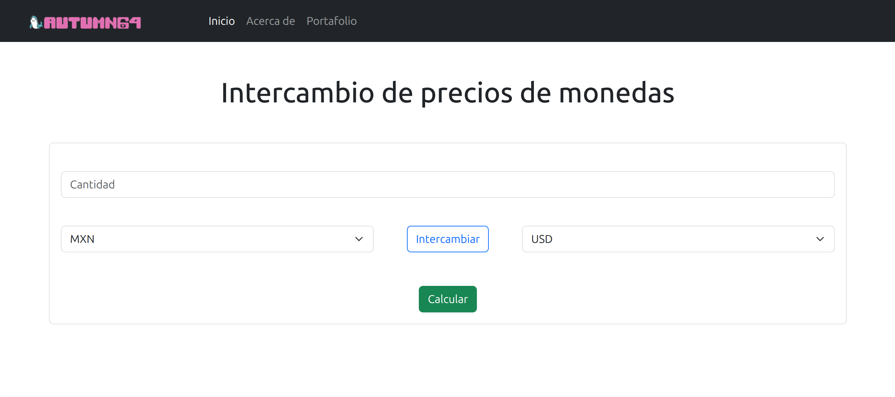
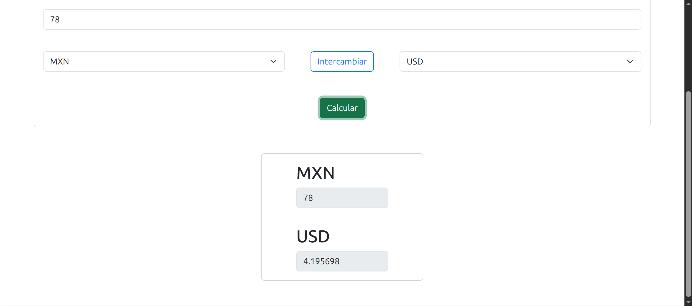
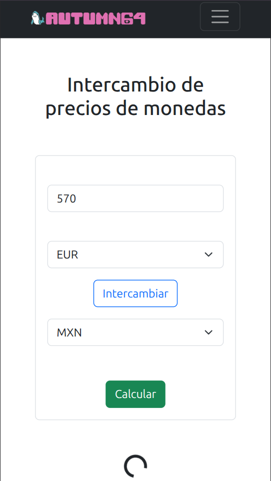

# 🖥️ Autumn64's Portfolio

<div id="header" align="center">
  
</div>

## Intercambio de precios de monedas con Flask y Bootstrap


### Descripción

Ejemplo de implementación básica de una API en Flask que obtiene información
sobre tasas de cambio desde [currencylayer](https://currencylayer.com/), y que
la despliega mediante Bootstrap.

### Características

- Mediante Flask se expone una API que permite obtener la información desde cualquier cliente.
- Utiliza la API gratuita de currencylayer para calcular las tasas de cambio.
- Maneja situaciones de asincronía desde JavaScript/jQuery y Bootstrap.
- Realiza validación de datos básica.

### Capturas





### Cómo hostear

- Descargue o copie los archivos y carpetas de este directorio, o clone este repositorio:

```bash
git clone https://codeberg.org/Autumn64/portfolio.git
```

- Cree un entorno virtual de Python:

```bash
python3 -m venv .
```

- Instale `flask`, `flask-cors`, `dotenv` y `requests`.

```bash
python3 -m ensurepip
pip install flask flask-cors dotenv requests
```

- Cree una cuenta en [currencylayer](https://currencylayer.com/) y obtenga su clave API.

- Guarde su clave API en un archivo `.env` dentro de la carpeta `src/`:
```
SECRET_KEY=API
```

- Ejecute el archivo `main.py`. Flask se expondrá al localhost y a la dirección IP local en el puerto 5000:

```bash
python3 main.py
```


#### Todo el código en este repositorio está [bajo el dominio público de acuerdo con la CC0](https://creativecommons.org/public-domain/cc0/), con algunas librerías, módulos y contenidos pudiendo poseer distintas licencias copyleft, libres y permisivas. Este proyecto está destinado a su distribución para propósitos no comerciales, y ni la propietaria del proyecto ni sus colaboradores son responsables del uso que cualquiera fuera de éste pueda dar al _software_ proporcionado o a sus insumos.