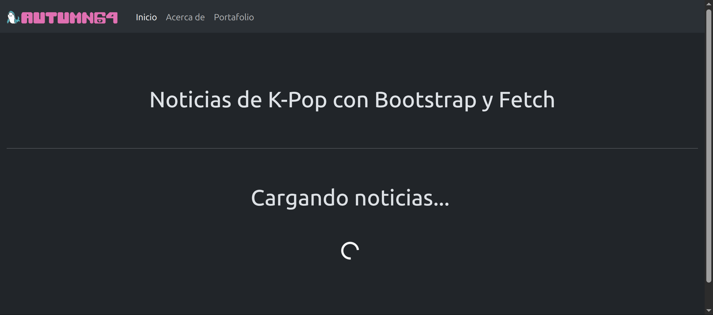
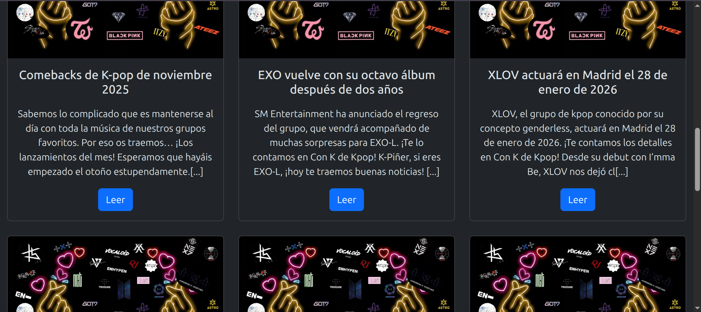

# 🖥️ Autumn64's Portfolio

<div id="header" align="center">
  
</div>

## Noticias de K-Pop en Bootstrap


### Descripción

Ejemplo de aplicación básica de Bootstrap para hacer un portal de noticias de K-Pop simple y minimalista.

### Características

- Es responsivo y está basado en Bootstrap.
- Procesa la información mediante jQuery y la API Fetch.
- Simula una situación de asincronía en la recuperación de los datos.

### Capturas




### Cómo hostear

- Descargue o copie los archivos y carpetas de este directorio, o clone este repositorio:

```bash
git clone https://codeberg.org/Autumn64/portfolio.git
```

- Copie los archivos fuente de este proyecto a su servidor local (Apache, NGINX u otro).

- Acceda mediante la URL de su servidor. Al ser un sitio web estático debería de mostrarse sin necesidad de configuraciones adicionales.


#### Todo el código en este repositorio está [bajo el dominio público de acuerdo con la CC0](https://creativecommons.org/public-domain/cc0/), con algunas librerías, módulos y contenidos pudiendo poseer distintas licencias copyleft, libres y permisivas. Este proyecto está destinado a su distribución para propósitos no comerciales, y ni la propietaria del proyecto ni sus colaboradores son responsables del uso que cualquiera fuera de éste pueda dar al _software_ proporcionado o a sus insumos.